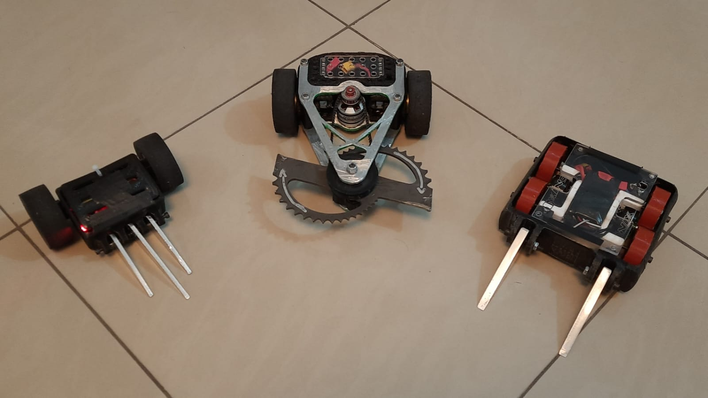
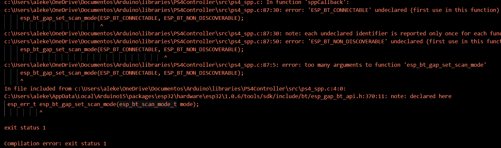

# **Combate** 

Repositório de arquivos do squad de combate da Project Neon. O repositório está divido com relação aos projetos da equipe, sendo que atualmente a equipe possui 2 robôs na categoria _Antweight_ (454 g):
- `Doente:` robô do tipo rampa móvel, controlado por motores brushless através de locomoção tangenciada;
- `Cirrose:` robô de arma ativa do tipo _horizontal spinner_ controlado por motores N20.

1 robô na categoria _Fairyweight_ (150 g): 
- `Soluço:` robô do tipo rampa móvel, controlado por motores N20.

~~E 1 robô na categoria *Beetleweight*:~~

Os arquivos referentes a eles estão separados com base nos núcleos que constituem os robôs, são eles: 
 - `Eletrônica:` onde estarão os arquivos dos circuitos desenvolvidos no KiCad para o controle dos robôs através da ESP32;
 - `Mecânica:` onde estarão os arquivos da modelagem mecânica dos robôs desenvolvidas no Fusion 360;
 - `Software:` onde estarão os códigos utilizados para o controle dos robôs, sendo subdividos nas duas formas de controle adotadas pela equipe atualmente, o controle de PS4 e o controle utilizando o protocolo ESP-NOW.
 
 Em cada diretório relacionado a esses núcleos, serão encontrados os arquivos e informações à respeito do desenvolvimento.

# **Instalação**
Para realizar o upload dos códigos nos robôs, é necessário que alguns programas estejam instalados no computador. A IDE utilizada para o desenvolvimento dos códigos é a **Arduino IDE**, que fornece uma forma bem simples de realizar o desenvolvimento dos códigos para a ESP32.
A configuração do sistema para o uso da Arduino IDE com a ESP32 pode ser feita através das seguintes etapas:
1. Primeiramente deve ser realizada a instalação do driver para o chip de conversão USB-Serial - esse driver permite a ESP32 seja reconhecida pelo sistema. O chip pode variar em relação ao modelo da ESP32 utilizado, porém os mais comuns são o [CH340](https://www.blogdarobotica.com/2020/03/21/instalando-driver-serial-para-arduinos-com-chip-ch340/) e o [CP2102](https://www.silabs.com/developers/usb-to-uart-bridge-vcp-drivers?tab=downloads).
2. A segunda etapa é adicionar a ESP32 ao gerenciador de placas da Arduino IDE, isso pode ser feito diretamente pelas configurações da Arduino IDE através de algumas [etapas](https://www.fernandok.com/2018/09/instalando-esp32-no-arduino-ide-metodo.html).
3. Agora, é necessário adicionar as bibliotecas utilizadas para nos nossos códigos. Essas bibliotecas se encontram no próprio repositório, sendo elas `PS4-ESP32` e `Arduino-ESP32-Servo.`
4. Por fim, é necessário instalar o [SixAxis Pair Tool](https://sixaxispairtool.en.lo4d.com/download). Este _software_ é utilizado para o caso dos códigos que utilizam o controle de PS4. Essa ferramenta permite atribuir um endereço MAC ao controle de PS4. A atribuição do endereço é importante pois esse endereço deve ser incluído no código do robô para fazer o pareamento com o controle.

# **Problemas**

Alguns problemas podem ocorrer durante a instalação das bibliotecas utilizadas no desenvolvimento de código utilizando as ferramentas para uso do controle de PS4. Aqui, serão listados alguns deles com suas respectivas soluções encontradas.

## **Troca de controle**

**Problema**:

 Um dos problemas recorrentes utilizando ocorre durante a troca de controles utilizados por uma placa. Mais precisamente, este problema ocorre no momento em que é realizada a troca de endereço MAC utilizando o SixAxisPairTool. Ao realizar essa troca, a ESP32 não estabelece conexão com o novo controle.

**Solução**: 

Para solucionar este problema é necessário limpar a memória flash da placa antes de realizar o upload do código que contém o endereço MAC redefinido. A memória flash é a unidade de memória responsável pelo armazenamento das instruções realizadas pelo microcontrolador. 

Esse procedimento é realizado através do [esptool](https://docs.espressif.com/projects/esptool/en/latest/esp32/index.html) - uma ferramenta baseada em Python utilizada para realizar configurações em chips Espressif. Para instalar o esptool, basta executar o seguinte comando (é necessário possuir o [Python](https://www.python.org/downloads/) instalado para utilizar o esptool):

`$ pip install esptool`

Com o esptool instalado, basta rodar o seguinte comando para limpar a memória flash:

`$ python -m esptool --chip ESP32 --port <Porta_da_ESP> erase_flash`

## **Versão da biblioteca da ESP32 no Arduino IDE**

**Problema:**

 Esse problema é extremamente comum ao utilizar a biblioteca `PS4-esp32`. Ele ocorre durante a compilação do código utilizando essa biblioteca, resultando em um erro como:

**Solução:**

Esse erro é ocasionado por uma incompatibilidade entre a biblioteca `PS4-esp32` e a biblioteca de ESP32 para Arduino IDE. Isso ocorre pois existem dois links que podem ser colados na configurações do Arduino IDE (conforme [tutorial]( https://www.fernandok.com/2018/09/instalando-esp32-no-arduino-ide-metodo.html) ) para realizar a instalação da biblioteca de ESP32, sendo eles:

1. https://dl.espressif.com/dl/package_esp32_index.json

2. https://raw.githubusercontent.com/espressif/arduino-esp32/gh-pages/package_esp32_index.json

Cada um desses links pode instalar versões diferentes da biblioteca da ESP32 para Arduino IDE, de forma que essas versões podem causar compatibilidade com a biblioteca do controle de PS4. Esse erro é causado por algumas linhas de código presente na biblioteca, e pode ser solucionado através de algumas alterações básicas no arquvio `ps4_spp.c` da biblioteca do controle de PS4. Como forma de facilitar esse procedimento, duas versões dessa biblioteca se encontram no diretório `Bibliotecas`, cada uma relacionada aos links numerados anteriormente. 

# **Fontes**
1. [Biblioteca PS4](https://github.com/aed3/PS4-esp32)
2. [Biblioteca Servo ESP32 - Arduino IDE](https://madhephaestus.github.io/ESP32Servo/annotated.html)
