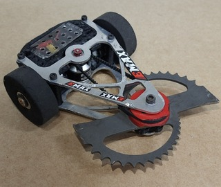

# **Cirrose** 

Cirrose é um dos robôs de combate da categoria Antweight (454g) da Project Neon. Esse é um robô de duas rodas, caracterizado por sua arma ativa do tipo *horizontal spinner* - que funciona como um poderoso disco de inércia movido através de um motor *brushless*.

O Cirrose, assim como todos os robôs da categoria de combate da Project Neon, é controlado por um controle de PS4. Ele é programado para funcionar através dos seguintes comando:

* **Analógico esquerdo**: realiza a locomoção linear, definindo a velocidade do robô, e o sentido da locomoção;

* **Analógico direito**: realiza a locomoção angular, definindo para qual lado o robô irá virar, e a angulação do giro;

* **Seta para cima**: define o modo de locomoção padrão do robô, para quando ele está virado para cima;

* **Seta para baixo**: define o modo de locomoção invertido do robô, para quando ele é virado durante a luta;

* **Quadrado**: trava a arma; 
* **X**: envia o valor de piso para o brushless da arma;
* **R1**: realiza a aceleração discreta da arma, aumentando a velocidade de rotação a cada vez que o botão é pressionado;
* **R2**: realiza a aceleração contínua da arma, respondendo conforme a intensidade com que o gatilho é pressionado.

Com base nesses comandos, é ~~im~~possível controlar o robô através do controle de PS4. Para realizar a configuração do controle de PS4, basta seguir as instruções apresentadas no `combate/README.md` do dirétorio raíz da equipe de combate, e utilizar o código apresentado no diretório `./Software/`.

# **Eletrônica**

O Cirrose é composto pelos seguintes componentes eletrônicos:

* ESP-32 Dev Module;

* Ponte H - TB6612FNG;

* 2 Motores DC N20 - 600 RPM;

* ESC - BLHeli_S Cyclone 35A;

* Motor Brushless - EMAX XA2212;

* 1 Bateria LiPo 4S.

